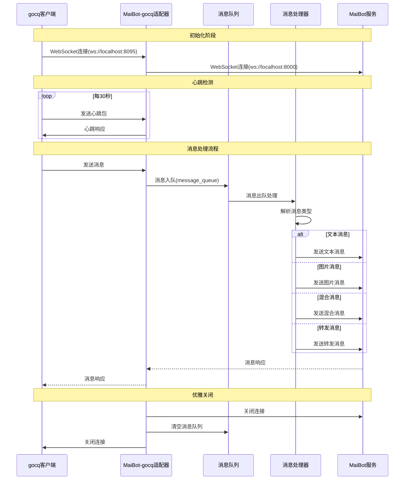

# MaiBot 与 gocq 的 Adapter
运行方式：独立/放在MaiBot本体作为插件

# 使用说明
请参考[官方文档](https://docs.mai-mai.org/manual/adapters/napcat.html)

# 消息流转过程

# TO DO List
- [x] 读取自动心跳测试连接
- [x] 接受消息解析
  - [x] 文本解析
  - [x] 图片解析
  - [x] 文本与消息混合解析
  - [ ] 转发解析（含图片动态解析）
  - [ ] 群公告解析
  - [x] 回复解析
  - [ ] 群临时消息（可能不做）
  - [ ] 链接解析
  - [x] 戳一戳解析
    - [x] 读取戳一戳的自定义内容
  - [ ] 语音解析（？）
  - [ ] 所有的notice类
    - [ ] <del>撤回</del>
- [x] 发送消息
  - [x] 发送文本
  - [x] 发送图片
  - [x] 发送表情包
  - [x] 引用回复（完成但是没测试）
  - [ ] 戳回去（？）
  - [ ] 发送语音
- [x] 使用echo与uuid保证消息顺序
- [x] 执行部分管理员功能
  - [x] 禁言别人
  - [x] 全体禁言
  - [x] 群踢人功能

  # 特别鸣谢
  特别感谢[@Maple127667](https://github.com/Maple127667)对本项目代码思路的支持